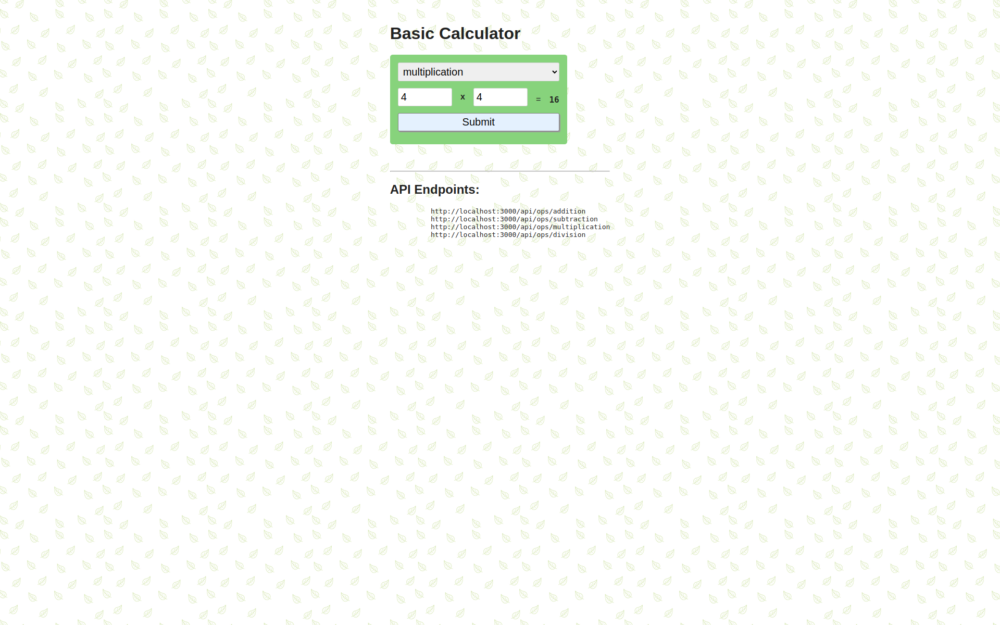

# CI/CD Pipeline for Deploying a Simple Node/Express App to Dockerhub

## Setup

- Install the NodeJS plugin from `Jenkins Available Plugins`


- Configure NodeJS to be able to run commands.


- Access NodeJS as follows from `Jenkinsfile`(take note of `20.x` on the screenshot and the config below):

```jenkins
    tools {
        nodejs '20.x' 
    }
```

- Install `Docker` & `Docker Pipeline` plugins


- Create an access token for login in your DockerHub account (`https://hub.docker.com/settings/security`)

- Add new Jenkins Credential. Copy the `access_token` and paste it on the password field (see the image):


- Access the created DockerHub credentials as follows (`Jenkins` file):

```
pipeline {
    agent any
    environment {
        DOCKERHUB_CREDENTIALS = credentials('what_you_set_on_the_ID_field(check image above)')
    }
}
```

**Setup resources**

- [Configuring NodeJS on Jenkins](https://www.youtube.com/watch?v=cm_oM3yoB5Q&ab_channel=CloudBeesTV)

- [Configuring Docker on Jenkins](https://www.youtube.com/watch?v=alQQ84M4CYU&ab_channel=CloudBeesTV)

- [Configuring Email Notifications](https://www.youtube.com/watch?v=HZwnGjmzLqk&ab_channel=DerrickMbarani)

##  Basic Calculator



[link to app-screenshots.pdf file]('./app-screenshots.pdf')

A simple web application for simple arithmetic: 
- Addition
- Subtraction
- Multiplication
- Division

Repo name: sit725-2023-t1-prac2

WebPage: http://localhost:3000/

## Setup

- Clone the repo

- Make sure you have npm installed and node version 18+

```bash
    npm install
``` 

```bash
    node index.js
``` 

API Endpoints:
```markdown
http://localhost:3000/api/ops/addition
http://localhost:3000/api/ops/subtraction
http://localhost:3000/api/ops/multiplication
http://localhost:3000/api/ops/division
```


